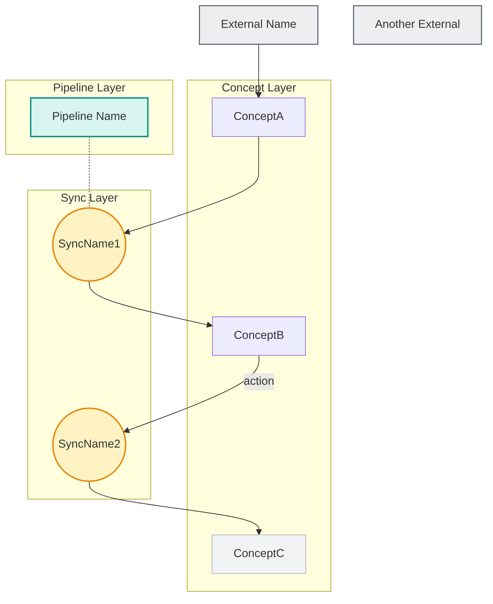

# 架构地图生成（wyx:map）

生成**架构地图**——把项目里全部概念、管道、sync 规格合成的一个视图。地图显示概念之间的关系、数据往哪里流、涉及哪些外部系统。产出一份 `ARCHITECTURE.md`，内含 Mermaid 关系图、依赖矩阵与数据流路径。`ARCHITECTURE.md` 是给人看的定位与代码评审参考文档——它不被 wyx 的 hook 消费。

## 如何解读用户参数

从参数判断模式：

- **路径**（如 `src/lib/server/`）：**限定范围模式** —— 只映射这个路径下找到的规格。适合在不受无关模块干扰的情况下映射一个子系统。
- **没有参数**：**全项目模式** —— 找出并映射整个项目的全部 wyx 规格。这是最常见的用法。对于概念数在 15 个以上的项目，建议改用限定范围模式以保持图的可读性。
- **发现 0 份规格**：输出「未找到 wyx 规格。先跑 `wyx:concept` 创建第一份规格。」然后停止。

## 预检：干净就跳过

在读取全部规格之前，先判断是否需要重新生成：

1. 如果目标目录里已有 `ARCHITECTURE.md`，把它的修改时间与所有规格文件对比。
2. 用 `find . -name "CONCEPT.md" -o -name "PIPELINE.md" -o -name "SYNCS.md" -newer ARCHITECTURE.md`（若给了路径则限定范围）找出上次生成之后被修改的规格。
3. 如果没有任何规格文件更新，报告「ARCHITECTURE.md 已是最新（生成于 [日期]，此后规格无变化）」然后停止。
4. 如果有规格文件更新，执行下面这套段落级比对——只有真的做过比对才能跳过，绝不允许盲目跳过：
   1. 只读被改动规格里参与建图的段落：`## interactions`、`## dependencies`、`## data boundary`、`## coordination graph`，以及 `PIPELINE.md` 的 `## purpose`。这些正是第二步的建图来源——两者刻意保持完全一致，所以一次跳过绝不会掩盖真实的图变更。
   2. 用 `git diff` 比对这些段落的**文本**——是文本比对，绝不是对渲染出的图做判断。被监视文本逐字节相同，就保证派生出的图相同。
   3. 如果被监视文本变了，或者 `ARCHITECTURE.md` 不存在，进入第一步。
   4. 如果逐字节相同：在 `ARCHITECTURE.md` 的 `> Generated by` 头部下面紧接着插入或更新一行 `> Verified current on [今天的日期]`。`> Generated by` 那一行保持不动——图没有被重新生成，只是被重新确认。这次编辑会刷新文件 mtime，让 SessionStart 的陈旧提醒不再每次会话重复触发。
   5. 报告「ARCHITECTURE.md 已是最新（建图段落无变化——已于 [今天的日期] 确认）」然后停止。

## 第一步：发现全部规格

1. 用 Glob 找 `**/CONCEPT.md`、`**/PIPELINE.md`、`**/SYNCS.md`（若给了路径则限定范围）。
2. 读取找到的每一份规格。
3. 建立清单：记录每份规格的类型、名称、目录与关键段落。

### 并行读取

发现 10 份以上规格时，用只读的探索型子 agent 并行读取。**在派发时显式指定较低档位的模型**（上游 wyx 固定用 `sonnet`）：只读的规格阅读是机械性的扇出，固定模型能让这些并行读取保持低成本，也不会继承会话模型——即使会话跑在最贵的档位上也不受影响。不到 10 份时直接 Read 更快（派发开销超过读取时间）。只读子 agent 结构上没有写入 / 编辑能力。

- 每个子 agent 按目录邻近性分配 3-5 份规格。
- 每个子 agent 读规格并返回：类型、名称、目录，以及关键段落（interactions、dependencies、data boundary、coordination graph）。
- 全部子 agent 完成后，在主上下文合并清单，进入第二步。

## 第二步：提取关系

按这个**优先级顺序**从规格派生图的边（越靠前越权威）：

1. **`SYNCS.md` 的 `## coordination graph`** —— 解析文本示意图。每个 `[Source] --(action)--> (SyncName) --> [Target]` 变成边。
2. **`CONCEPT.md` 的 `## dependencies`** —— 每条依赖变成一条边。外部依赖（API、CLI、数据库、环境变量）变成 `:::external` 节点。
3. **`CONCEPT.md` 的 `## interactions`** —— 每条交互变成一条边。方向不明确时用 `-.->`。
4. **`PIPELINE.md` 的 `## data boundary`** —— 每条归属声明表明哪个概念拥有哪份数据。
5. **`PIPELINE.md` 的 `## purpose`** —— 用作管道节点的标签。

**边方向约定**：从提供方指向消费方。「A 依赖 B」意味着 `B --> A`。「A 调用 B.action()」意味着 `A --> B`。

**虚线边约定**（`-.->`）：用于间接、可选或导航性的关系，而不是硬依赖：

- 方向不明确（分不清提供方 / 消费方）
- 可选外键或软引用（如可空外键、按约定查找）
- 导航性关联（只读的交叉引用，不是归属）

**边标签**：使用规格里的**原动词**，不要改写。规格写 "calls generate()"，标签就是 `generate`；规格写 "reads recommendations"，标签就是 `reads recs`。

**未写规格的引用**：当 `SYNCS.md` 的 `## coordination graph` 或 `CONCEPT.md` 的 `## interactions` 引用了一个没有对应 `CONCEPT.md` 的概念时，把它作为普通节点纳入图中，并在 `## coverage` 一节里标出（如「Referenced but unspecced: Unlinked（在 SYNCS.md 中）」）。

不要用 `:::external`——它们是缺少规格的内部模块，不是外部系统。

## 第三步：构造节点 ID

**节点 ID 派生规则**：取每个 CamelCase 单词的首字母并大写。StockData 变成 SD，ScheduledEvents 变成 SE。冲突时追加数字（SR1、SR2）。

**按类型选节点形状**：

- 概念节点：`ID["ConceptName"]`（矩形，默认样式）
- sync 节点：`ID(("ShortName")):::sync`（双圆括号 = 圆形）
- 管道节点：`ID["Pipeline Name"]:::pipeline`（矩形 + pipeline 类）
- 外部节点：`ID["External Name"]:::external`（矩形，列在概念子图之前）
- 基础设施型概念：`ID["Name"]:::infra` —— 这只是**可选的外观样式**。**不要**去推导它：没有任何确定性的判据能判断「这算不算基础设施」（作者完全可以把功能等价的持久化概念建模成普通概念节点，也可以标成 `:::infra`）。没有任何建图规则读取这个标记，它只决定颜色。规格或之前的地图已经用了 `:::infra` 就保留；绝不要以「修正」为名添加或去掉它。

## ARCHITECTURE.md 格式

输出写成项目根目录（或限定范围目录的根）下的 `ARCHITECTURE.md`。

严格使用这个结构：

````markdown
# architecture: [项目名]

> Generated by `wyx:map` on [YYYY-MM-DD]
> Verified current on [YYYY-MM-DD]  <!-- 新生成时省略这一行；预检的跳过路径在重新确认图未变化时才写它 -->

## relationship graph



## dependency matrix

| Concept | Depends On | Depended By |
|---------|-----------|-------------|
| ConceptA | External (ext) | ConceptB (via sync) |
| ConceptB | ConceptA | ConceptC (via sync) |
| ConceptC | ConceptB | -- (terminal) |

## data flow paths

**[业务流程描述]:** Concept1 -> Concept2 -> Concept3 — [一句话说明这条路径端到端做了什么]
**[业务流程描述]:** Concept4 -> Concept5 — [一句话说明]

## coverage

- **12/18 modules specced (67%)**
- Specced: `src/lib/auth/CONCEPT.md`, `src/lib/data/PIPELINE.md`, ...
- Uncovered: `src/lib/notifications/`, `src/lib/billing/`, ...
````

## 输出稳定性规则

这些规则保证多次运行输出可复现：

1. **节点顺序**：每个子图内的概念按名称字母序排列。外部节点按字母序排在概念子图之前。
2. **子图顺序**：固定的层次顺序：外部节点 -> Concept Layer -> Sync Layer -> Pipeline Layer。空的层省略（例如没有 `PIPELINE.md` 就不要 pipelines 子图）。
3. **边的顺序**：先按源节点分组（字母序），每个源内部再按目标（字母序）。
4. **classDef 样式**：**逐字照抄**——十六进制值是硬编码的，绝不自己换颜色。概念节点刻意保留 Mermaid 默认样式，让概念层（主角）成为基准；辅助层都落在同一条低饱和带里，谁都不会盖过概念（外部节点是低调的中性边界，不是抢眼的填充）：
   - `classDef external fill:#eceef0,stroke:#5c6770,stroke-width:1.5px`
   - `classDef sync fill:#fff3c4,stroke:#e8870c,stroke-width:2px`
   - `classDef pipeline fill:#d8f5f0,stroke:#0c9488,stroke-width:2px`
   - `classDef infra fill:#f1f3f5,stroke:#b0b7be,stroke-width:1px`
5. **边方向**：从提供方指向消费方（见第二步的约定）。
6. **表格行序**：按概念名字母序。
7. **边标签**：规格里的原动词，绝不改写。
8. **矩阵单元格必须逐一列举**：依赖矩阵的单元格**必须**点名它的成员，绝不能压缩成量词（`All concepts`、`N of M`、`5/7`）。
   这条规则只作用于单元格本身——它不新增节点、不重新归类、也绝不把依赖挪到其他行（`:::external` 存储在其消费方的 Depends-On 里仍然是文本依赖；一个扇出到所有概念的节点只在它自己的 Depended-By 单元格里逐一列举，绝不摊到每个消费方的 Depends-On）。
   适用范围：概念行与 infra 行；外部节点和 sync 节点豁免（它们没有概念行）。
   量词单元格能通过「这一行存在吗」的检查，却让人无法把它与图里的扇出边核对——而且它往往是假的（例如某个存储服务 26 个概念里只服务 19 个却写成「All concepts」，恰好掩盖了那些没有自己表的概念，而这正是 wyx 用来发现冗余数据存储的信号，见设计规则 5）。

## Mermaid 语法安全规则

这些规则防止渲染失败：

- 节点标签里**不要 emoji**（会破坏 Mermaid 解析器）
- **不要用 `~~~`**（隐形连线）—— 点线关联用 `-.-`
- classDef 里**不要 `stroke-dasharray`**
- **节点 ID 要短**（标签最多约 15 字符）
- **含空格的标签要加引号**：写 `["Pipeline Name"]`，不要写 `[Pipeline Name]`
- **重复的边**：同一对节点之间有多种关系时，必须用不同标签区分（如 `RD -->|sessionEnded| SP` 和 `RD -->|stateChanged| SP`）。没有标签的重复边会被 Mermaid 合并成一条。

## Mermaid 设计约束

这些是有意的设计选择，不是解析器限制：

- **不用嵌套子图** —— Mermaid 在嵌套上有未修复的渲染缺陷（标签截断、方向继承）。基础设施型概念改用 `:::infra` 样式类。
- **不要连线指向子图名** —— 连到子图内部的具体节点，边的走线才可预测。绝不要写 `Node -.-> layerName` 来概括扇出；把每条扇出边都画到具体节点上。完整关系已经在依赖矩阵里逐节点无损保留（输出稳定性规则 8），绝不会被搬出图外。稠密节点（例如每个概念都要持久化到的存储）保留它全部的独立边。
- **视觉密度是有意不解决的问题** —— 大型高连通项目渲染出来必然稠密，而没有任何不依赖分类的确定性规则能把它变稀疏：任何推断出来的基础设施 / 领域分组都会在两次运行之间摇摆，把 `git diff` 搅乱。确定性和可信的 `git diff` 优先于渲染密度。可读性的逃生口是**限定范围模式**（`wyx:map src/path/`），一次只映射一个子系统，不对任何东西做稀疏化。

## 生成之后

1. 立刻写入 `ARCHITECTURE.md` 文件（它完全派生自规格，随时可重新生成）。
2. 呈现简短摘要：节点数、边数、观察到的关键模式、覆盖率统计。
3. 如果 `ARCHITECTURE.md` 已存在，直接覆盖——不需要确认。
4. 说明：Mermaid 图在 GitHub 和 VS Code 里可视化渲染；在终端里显示为原始文本（仍然可读）。
5. 如果覆盖了 `ARCHITECTURE.md`，建议：「跑 `git diff ARCHITECTURE.md` 查看改动。」
6. 在 coverage 一节里，为每个未覆盖模块建议对应命令：概念候选用 `wyx:concept 路径/`，数据转换目录用 `wyx:pipeline 路径/`，需要整体评估则用 `wyx:audit`。

## 与其他 wyx 模式的关系

- **`wyx:concept`**：最主要的数据来源。每份 `CONCEPT.md` 的 `## interactions` 和 `## dependencies` 汇入架构地图的边与依赖矩阵。
- **`wyx:pipeline`**：`PIPELINE.md` 的 `## data boundary` 与 `## purpose` 提供管道节点和数据归属边。
- **`wyx:sync`**：`SYNCS.md` 的 `## coordination graph` 是 sync 流向边最权威的来源。地图把 `SYNCS.md` 的局部视图合成为项目级视图。
- **`wyx:concept drift`**：生成地图之前先用漂移检测确认规格是最新的。基于陈旧规格生成的架构地图会误导人。
