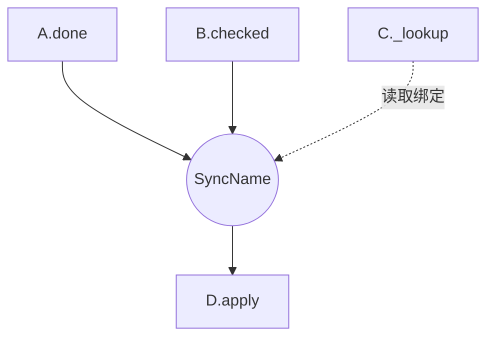

# 架构地图（`map` 模式）

从指定子树（默认全仓）的规格派生 `ARCHITECTURE.md`：同步关系、产品依赖、数据流与覆盖情况。地图服务导航，不被 hooks 消费。无规格则报告并建议 `audit` 或 `concept`，不生成空图。含旧 wyx 段落的文件不参与建图，在 coverage 里列为待迁移。

## 发现与新鲜度

1. 搜索 `CONCEPT.md`、`PIPELINE.md`、`SYNCS.md`，并读取总体 PRD 索引链接的暂存规格。排除依赖、构建与生成目录；同一权威规格只计一次。
2. 记录路径、名称、格式与外部引用。限定范围时把跨范围目标列为边界节点，保留其来源；不把内部未建规格模块误标为外部系统。
3. 读取所有参与建图的内容：概念名称/purpose、sync 的 app/include/when/where/then、管道来源/输出/data boundary，以及 PRD 产品依赖。
4. 默认重新派生并比较结果；相同则不改文件。mtime 不足以跳过：删除、重命名、暂存文件、sync 条件变化都可能改变地图。只有保存过完整来源路径集合与内容指纹时，才能据此安全跳过。

大量规格可分组读取；若使用子代理，只委派读取并继承用户模型设置，合并时核对清单完整性。

## 分别提取三类关系

### 同步关系

以 `sync` 块为权威。每条 sync 一个规则节点；全部 when 动作连入，全部 then 动作连出；where 查询另用虚线标为"读取/绑定"，不画成触发动作。多 when 是共同匹配，不是任一来源即可触发；保留合取条件和参数关联。级联或环按实际画出，并标注终止条件；环本身不是缺陷。

### 产品依赖

只用总体 PRD 明确的 extrinsic 依赖：`A → B` 表示纳入 A 的产品需要 B。与设计/审计方向一致；**不能从 sync 的 A→B 推导产品依赖**。未声明的依赖标未定义。外部依赖只有确为外部系统时才建 external 节点。

### 数据归属

从 `PIPELINE.md` 的 sources / outputs / data boundary 提取拥有者、读取和写入方向，保留动作/查询名称；只在管道确实关联某条 sync 时连接它们。纯数据引用不自动成为硬依赖。

## 输出模板

````markdown
# architecture: <项目>

> Generated by `concept-guardrails map` on <日期>
> Scope: <目录、来源清单或索引、规格版本>

## relationship graph



A.done 与 B.checked 共同匹配；query 只绑定值。

## dependency matrix

| Concept | Requires (extrinsic) | Required by |
| --- | --- | --- |
| A | B | — |
| B | — | A |

## data flow paths

- <有规格依据的路径、含义、来源链接>

## coverage

- <已读规格、未建规格的内部引用、范围外目标、未核实来源>
````

## 稳定性与可读性

- 节点 ID 用稳定的 ASCII 名，冲突加可复现的路径后缀；显示标签用引号并转义特殊字符。节点、边、矩阵按名称与路径排序。
- 规则名和动作名沿用规格。多重关系逐一标注；矩阵逐项列出成员，不用“全部概念”等量词。
- 现有样式可保留；外部、sync、pipeline 只作视觉分类，不根据名称臆断 infra/领域层次。不要把样式偏好声称为 Mermaid 语法限制。
- 大图可按范围拆视图，保留跨范围边与来源索引，不能为稀疏效果删关系。只根据规格不能计算全仓模块覆盖率；未扫描代码分母时仅报规格数与未解析引用。
- 与已有文件比较后直接更新派生地图，保留非派生的人工作注。报告节点/规则数、关系变化及缺口；地图反映规格，不证明规格与代码一致，需要后者时运行漂移检查。
